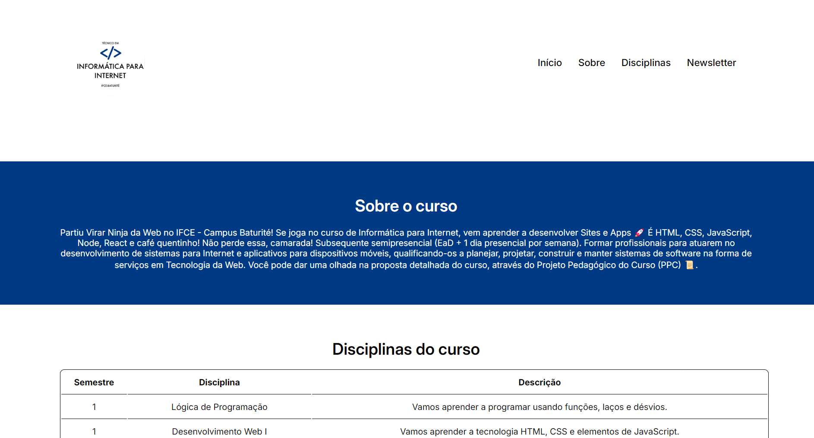

<h1 align="center">
  Avaliação II da Disciplina de Desenvolvimento Web I
</h1>

<ul>
  <li>
    <a href="#sobre-o-projeto">
      Sobre o projeto
    </a>
  </li>
  <li>
    <a href="#tecnologias">
      Tecnologias
    </a>
  </li>
  <li>
    <a href="#pre-requisitos">
      Pré-requisitos
    </a>
  </li>
  <li>
    <a href="#como-instalar-o-projeto">
      Como instalar o projeto
    </a>
  </li>
  <li>
    <a href="#como-executar-o-projeto">
      Como executar o projeto
    </a>
  </li>
  <li>
    <a href="#demonstração-da-aplicação">
      Demonstração da aplicação
    </a>
  </li>
  <li>
    <a href="#autor">
      Autor
    </a>
  </li>
  <li>
    <a href="#Licença">
      Licença
    </a>
  </li>
</ul>



## Sobre o projeto

Avaliação II da disciplina de Desenvolvimento Web I que o objetivo era elaborar uma página web sobre um tema de sua preferência (não podia ser o mesmo tema do site desenvolvido ao longo da disciplina). A página devia conter os seguintes itens:

**Arquivo HTML:**

1. Organização com tags semânticas do HTML (header, main, section, article, nav e foorter).
2. Pelo menos uma tabela e uma imagem.
3. Um menu de navegação para outras páginas com no mínimo três links (Os links não precisam apontar para uma página existente).
4. Uma logomarca e um cabeçalho com o nome do site.
5. Uma lista ordenada.
6. Um rodapé com o nome do autor (seu nome).
7. Um formulário de login no topo do site à direita.
8. Deve ser enviado, no espaço da atividade, a página com nome `index.html`.

**Arquivo CSS:**

Para formatação da página HTML crie um arquivo CSS que deve conter as seguintes funcionalidades:

1. Desenvolver um Template para o conteúdo HTML, use flexbox, grid ou ambos.
2. Formatar os itens da página usando propriedades CSS. Ex.: Estilos de fonte, imagem, bordas, links e listas.
3. Deve ser enviado, no espaço da atividade, a página com nome style.css

## Tecnologias

O projeto foi desenvolvido com as seguintes tecnologias:

- [HTML](https://developer.mozilla.org/pt-BR/docs/Web/HTML)
- [CSS](https://developer.mozilla.org/pt-BR/docs/Web/CSS)

## Pré-requisitos

Verifique aos seguintes pré-requisitos para poder instalar e executar o projeto:

1. Ter instalado um editor de código: [VS Code](https://code.visualstudio.com/download)
2. Ter instalado o [Git](https://git-scm.com/downloads)
3. Ter instalado a extensão [Live Server](https://marketplace.visualstudio.com/items?itemName=ritwickdey.LiveServer)

## Como instalar o projeto

Siga o passo a passo para instalar o projeto:

1. Abra o terminal e clone o repositório do projeto:

```bash
git clone https://github.com/pedroeuzebiojs/av2-dw1-tii-ifce
```

## Como executar o projeto

Siga o passo a passo para executar o projeto:

1. Entre na pasta do projeto clonado:

```bash
cd av2-dw1-tii-ifce
```

2. Abra a pasta do projeto clonado no editor de código de sua preferência. Caso seja o VS Code digite o comando:

```bash
code .
```

3. Abra o arquivo `index.html` com a extensão Live Server do VS Code

## Demonstração da aplicação

- [Exibir projeto](https://pedroeuzebiojs.github.io/av2-dw1-tii-ifce)

## Autor

<table>
  <tr>
    <td align="center">
      
      <br />
      Pedro Euzebio
    </td>
  </tr>
</table>

## Licença

O projeto está sob licença MIT. Veja o arquivo [LICENSE](./LICENSE) para mais detalhes.
